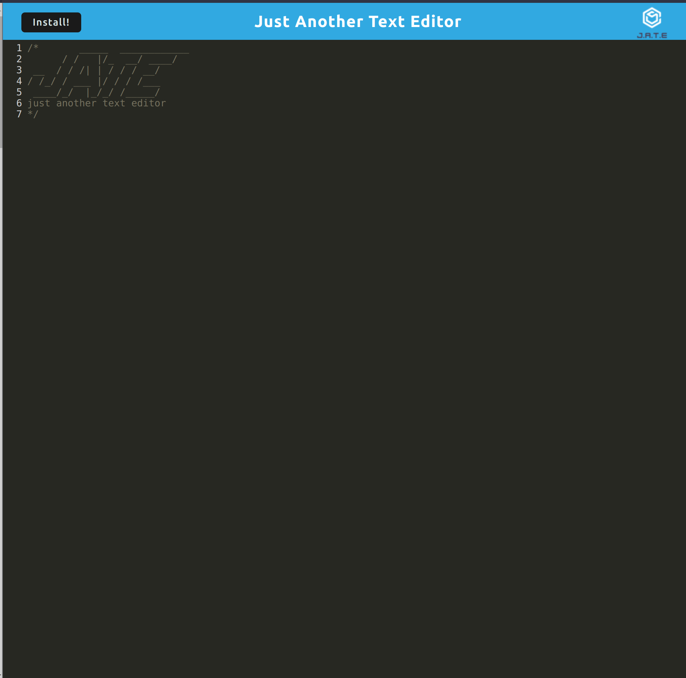

# PWA Text Editor

## Table of Contents
- [Description](#description)
- [License](#license)
- [Installation](#installation)
- [Usage](#usage)
- [Credits](#credits)
	- [Resources](#resources)
- [Tests](#tests)
- [Issues/Questions](#issuesquestions)
- [Contributing](#contributing)

## Description
A text editor that runs in the browser and can be downloaded to run offline.

## License

## Installation
First, clone the repo at `https://github.com/ryansheehy0/PWA_Text_Editor`.  Second, run `npm install` in the Develop folder.  Third, run `npm run start:dev` to start the app in dev mode.  Forth, go to localhost:3000 in order to see the app in your browser.

## Usage
Just use your text editor like any other text editor. Click the install button to use the text editor offline.

Check out the website [here](https://ryansheehy0-pwa-text-editor-5ad8a1f46c2c.herokuapp.com/).

## Credits

### Resources
- [webpack](https://www.npmjs.com/package/webpack)
  - And other npm webpack extensions
- [express](https://www.npmjs.com/package/express)
- [idb](https://www.npmjs.com/package/idb)

## Tests
Just [install](#installation) the code, start the server, and go to localhost:3000.

## Issues/Questions
If you have any problems please specify what the problem is and the exact steps that lead you to your problem.

If you have any questions or issues feel free to reach out to me at

Github: [ryansheehy0](https://github.com/ryansheehy0)

or

Email: ryansheehy0@gmail.com

## Contributing
To contribute just make a pull request.